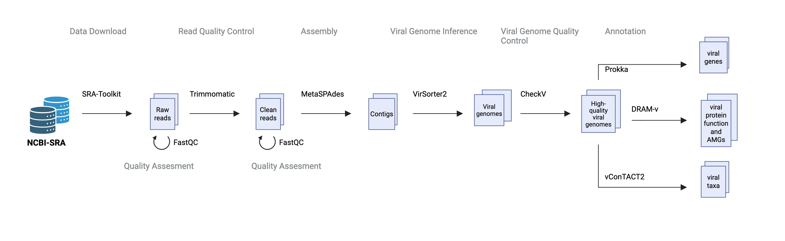

# HPC Viral Inference Pipeline

This repository contains training materials and scripts for running a viral metagenomic analysis pipeline based on the workflow from [KBase narrative 126189/27](https://kbase.us/n/126189/27/).


## 🔬 Overview

This pipeline demonstrates how to process metagenomic datasets to identify, classify, and annotate viral sequences using bioinformatics tools. It serves as both a learning resource and a practical implementation guide for viral metagenomics on high-performance computing (HPC) systems.

## 🦠 Why Study Viruses?

- Viruses are the "most abundant biological entities on the planet"<sup>[1](https://www.nature.com/articles/21119),[2](https://www.sciencedirect.com/science/article/pii/S0966842X05001083?via%3Dihub)</sup>, with 1031 virus-like particles<sup>[3](https://www.nature.com/articles/nature04160)</sup>
- 3% (0-18%) of any microbial genome is really a viral sequence<sup>[4](https://journals.asm.org/doi/10.1128/mmbr.67.2.238-276.2003),[5](https://onlinelibrary.wiley.com/doi/10.1046/j.1365-2958.2003.03580.x)</sup>
- On the topic of composition, 8% of the human genome is viral<sup>[6](https://www.nature.com/articles/35057062),[7](https://www.frontiersin.org/journals/immunology/articles/10.3389/fimmu.2018.02039/full)</sup>
- Move 1029 genes per day, globally<sup>[8](https://www.caister.com/backlist/jmmb/v/v1/v1n1/07.pdf),[9]</sup>
- Lyse between 20-40% of ocean microbes daily<sup>[10](https://www.nature.com/articles/nrmicro1750)</sup>
- They steal metabolic genes and can encode key metabolic components (like photosynthesis!)<sup>[11](https://journals.plos.org/plosbiology/article?id=10.1371/journal.pbio.0040234),[12](https://elifesciences.org/articles/03125),[13](https://www.science.org/doi/10.1126/science.1252229)</sup>
- Can infect other viruses (virophages)<sup>[14](https://www.nature.com/articles/nature07218)</sup>
- Viruses - not microbes - encode many of the toxins we think of as bacterial (bordtella, cholera, shiga, etc)<sup>[15](https://pmc.ncbi.nlm.nih.gov/articles/PMC2658872/)</sup>
- Fewer than 1% are culturable<sup>[16],[17](https://journals.asm.org/doi/10.1128/mmbr.68.4.686-691.2004)</sup>

Viruses are often hidden in datasets (both viral and microbial) this guide will help you find them!

## ⚙️ Pipeline Workflow

The pipeline processes a single metagenomic dataset from the Global Ocean Viromes collection through the following steps:

1. **Data Download**: Download metagenomic data from NCBI SRA and check quality with FastQC
2. **Quality Control**: Perform quality trimming and filtering with trimmomatic, followed by quality assessment using FastQC
2. **Assembly**: Assemble reads using metaSPAdes
3. **Viral Genome Inference**: Identify viral sequences with VirSorter2
4. **Viral Genome Quality Control**: Assess viral genome quality using CheckV
5. **Annotation**: Annotate sequences with:
   - Prokka (gene prediction and functional annotation)
   - DRAM-v (viral metabolic annotation, and annotation of AMGs)
   - vConTACT2 (viral clustering and taxonomic assignment)


{fig-align="center"}


## 📁 Contents
```
├── scripts/               # Pipeline execution scripts
├── data/                  # Sample data and test datasets
├── configs/               # Configuration files for tools
├── notebooks/             # Training notebooks and tutorials
   ├── 00_setup            # NOTE TO SELF: these notebooks could be sent as a pre to kbase?
   ├── 01_unix             # Basic UNIX training
   ├── 02_hpc              # HPC job scheduling and Apptainer/Singularity usage
   └── 03_viral_pipeline   # Viral inference pipeline walkthrough
└── docs/                  # Additional documentation
```

## ✅ Prerequisites

- GitHub account to clone the repository
- Access to an HPC cluster with job scheduling (e.g., SLURM, PBS)
- Apptainer or Singularity installed for containerized execution
- Basic knowledge of command-line operations and bioinformatics tools (See [link to training on UNIX])

---


## 🚀 Getting Started

1. Clone or download this repository:
   ```bash
   git clone https://github.com/hurwitzlab/hpc_viral_inference_pipeline.git
   cd hpc_viral_inference_pipeline
   ```
2. Choose your preferred viewing method from the options below
3. Open the training materials and follow along with the exercises


## 👀 Viewing the Training Materials

There are several ways to view and interact with the training materials:

### Option 1: View Pre-rendered HTML Files (Easiest)

1. Download the HTML files from the repository
2. Open them directly in your web browser
3. No additional software required

### Option 2: Use VS Code with Quarto Extension (Recommended for Editing)

If you want to edit or preview the materials while working on them:

1. Install [VS Code](https://code.visualstudio.com/)
2. Install the [Quarto extension](https://marketplace.visualstudio.com/items?itemName=quarto.quarto) for VS Code
3. Open the `.qmd` files in VS Code
4. Use the preview pane to see rendered output alongside your code
5. Press `Ctrl+Shift+K` (or `Cmd+Shift+K` on Mac) to render the document

### Option 3: Render with Quarto CLI

To render the Quarto documents yourself:

1. Install [Quarto](https://quarto.org/docs/get-started/)
2. Clone this repository:
   ```bash
   git clone https://github.com/hurwitzlab/brc_hazel_training.git
   cd brc_hazel_training
   ```
3. Render individual documents:
   ```bash
   quarto render document.qmd
   ```
4. Or render all documents:
   ```bash
   quarto render
   ```
5. Open the generated HTML files in your browser

### Option 4: Use RStudio

If you're familiar with RStudio:

1. Install [RStudio](https://posit.co/download/rstudio-desktop/) (version 2022.07 or later includes Quarto)
2. Open the `.qmd` files in RStudio
3. Click the "Render" button to preview documents

### Option 5: View raw files on GitHub

You can view the raw Quarto markdown files directly on GitHub, though formatting and code output won't be rendered.

---

## 🤝 Contributing

If you find issues or have suggestions for improvements, please open an issue or submit a pull request.


## 📧 Contact

For questions about the training materials, please contact the Hurwitz Lab (Mery Touceda-Suárez: mtouced@ncsu.edu or Bonnie Hurwitz: blhurwit@ncsu.edu) or the Sullivan Lab (Ben Bolduc: bolduc.10@osu.edu)

---


