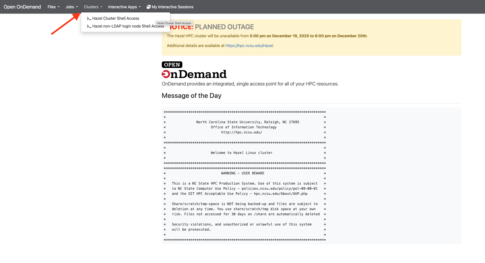

> Note: This tutorial draws heavily from the [Happy Belly Bioinformatics Unix Crash Course](https://astrobiomike.github.io/unix/unix-intro). Other resources can be found at the end of the tutorial.

Unix is very likely the most foundational skillset we can develop for bioinformatics. Many of the most common and powerful bioinformatics approaches happen in this text-based environment, and having a solid foundation here can make everything we’re trying to learn and do much easier. Additionally, unix is the language used by most High Performance Clusters (HPCs) and cloud computing, which is where we will be performing most of our computation going forward. Learning unix is essential for the process and analysis of large metagenomics datasets. 

Other reasons to learn Unix: 

- it’s the foundation for most of bioinformatics (and much more)
- enables the use of non-GUI (Graphical User Interface) tools
- improves reproducibility (GUI’s are super-convenient for lots of things, but they are not ideal when it comes to reproducibility)
- enables things like quickly performing operations on large files (without needing to read them into memory)
- can allow us to programmatically access data
- helps automate repetitive tasks (need to rename 1,000 files?)
- enables use of higher-powered computers elsewhere (servers/cloud-computing)

## What is Unix
UNIX is a family of innovative **operating systema** developed in the 1970s, designed for developers, with a command-line interface and a core kernel, or the fundamental code which allows software to manage hardware (handling critical functions like process scheduling, memory management, and device management). Like a lot of success sotories in programming (I am looking at you R), Unix spread due to its portability and through open community development and collaboration.

Many successful offshoots of Unix have been developed, which is why we might see the term “Unix-like”, in order to encompass all the systems that aren’t technically “Unix”.

Here are some terms that are often used interchangeably: 

| Term | What it is |
|------|------------|
| `shell` | what we use to talk to the computer; anything where we are pointing and clicking with a mouse is a Graphical User Interface (GUI) shell; something with text only is a Command Line Interface (CLI) shell |
| `command line/`<br>`terminal` | a text-based environment capable of taking input and providing output |
| `bash` | (Bourne Again SHell) is a specific type of shell – a command-line interpreter – that runs on UNIX-like operating systems. OR: the most common programming language used at a Unix command-line.  |
| `Unix` | a family of operating systems |

## Accessing the Command Line

**On Mac/Linux:**

- Open the Terminal application (Applications > Utilities > Terminal on Mac)
- You're already on a Unix-like system!

**On Windows:**

Windows uses a different operating system architecture and is not Unix-based. Its native command-line interface (Command Prompt or PowerShell) uses different commands and syntax. However, you can still access a Unix environment on Windows through:

- Install Windows Subsystem for Linux (WSL)
- Or use Git Bash
- Or access a remote server

::: {.callout-important}
Your HPC should have a web interface called "On-Demand". There you can access a terminal through the browser. You can use it for this training.
:::


{fig-align="center"}


## Running Commands
Once you have accessed the command line we need to talk about commands. 
Commands are programs that tell the computer to perform specific tasks. Think of them as verbs - they make things happen!

### Basic Command Syntax
The general structure of a command looks like this:
```bash
$ command argument
```
For example, the `date` command prints the current date and time:
```bash
$ date
Thu Nov 20 10:30:10 EST 2025
```
### Arguments, Flags, and Options
Most commands can be modified using **arguments** (also called flags, options, or parameters):

- **Required arguments**: Some commands need information to work. For example, `head` needs to know which file to display:
```bash
  $ head example.txt
```

- **Optional arguments**: These modify how a command behaves and usually start with a dash (`-`). For example, `head` normally shows the first 10 lines, but we can change that:
```bash
  $ head -n 5 example.txt    # Shows only first 5 lines
```

- **Positional arguments**: The order matters! The filename usually comes at the end.

::: {.callout-important}
## Important Rules

1. **Spaces matter!** The command line uses spaces to separate commands from arguments. This is why:
```bash
   $ date -u        # ✓ Correct - space separates command and flag
   $ date-u         # ✗ Wrong - looks for a command called "date-u"
```

2. **Dashes matter!** Arguments usually need a dash:
```bash
   $ date -u        # ✓ Correct
   $ date u         # ✗ Wrong - the program won't understand
```
:::

<br>

## Getting Help
Don't know what options a command has? Try these:
```bash
$ head -h           # Short help
$ head --help       # Detailed help
$ man head          # Manual page (press 'q' to quit)
```

**Pro tip**: You don't need to memorize commands! Looking up options when you need them is completely normal and expected.

<br>

## Tab-Completion: Your Best Friend
Start typing a filename and press `Tab` - the computer will complete it for you! This:
- Saves time typing
- Prevents typos
- Confirms the file exists where you think it does

::: {.callout-note}
## Try it: 
Type `head ex` then press `Tab`. If there's a file starting with "ex", it will auto-complete!
:::

<br>

## Best Practices 
This is a list of some of the practices you should keep in mind when working in Unix. 

1. **Use tab completion**: Press Tab to autocomplete file and directory names
2. **Check before deleting**: Use `ls` to verify what files match your pattern before using `rm`
3. **Use descriptive names**: Avoid spaces in filenames (use underscores or hyphens)
4. **Keep backups**: Always keep copies of original data files
5. **Document your work**: Keep notes or use comments in scripts (`#` for comments)
6. **Test on small datasets**: Before running commands on large files, test on a subset

## Common Pitfalls to Avoid
Watch out for these!

- **Case sensitivity**: `File.txt` and `file.txt` are different files
- **Spaces in names**: Use quotes or escape spaces: `"my file.txt"` or `my\ file.txt`
- **No undo button**: Be very careful with `rm` - deleted files are gone!
- **Overwriting files**: `>` overwrites; use `>>` to append
- **Hidden files**: Files starting with `.` are hidden (use `ls -a` to see them). An example of this is the `.bashrc` file, which configures your bash shell environment. We will learn more about `.bashrc` later in this training.

<br>

## Other sources
- https://bioinformatics.ccr.cancer.gov/docs/unix-commands-for-beginners/unix_for_beginners/


